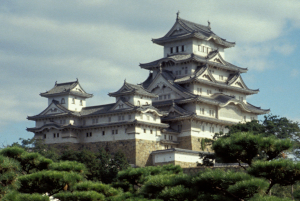

# Kyushu, Japan

This is a report of my bicycle trip through Kyushu and Shikoku Japan in 1993.

We took the train to Himeji then the ferry from Himeji to Beppu.
From Beppu we went south to get on Route 265, then follwed Route 265 to its end at Kobayashi City.
From Kobayashi we went east to the coast, then north to the city of Usuki were we took the ferry to Yawatahama in Shikoku.

* [Image Index](https://htmlpreview.github.io/?https://raw.githubusercontent.com/glevand/kyushu-trip/blob/master/Kyushu-Trip.html) - Everything on one page.

## Licence & Usage

All files in the
[Kyushu Trip Report](https://github.com/glevand/kyushu-trip)
are Copyright Geoff Levand, All Rights Reserved.
